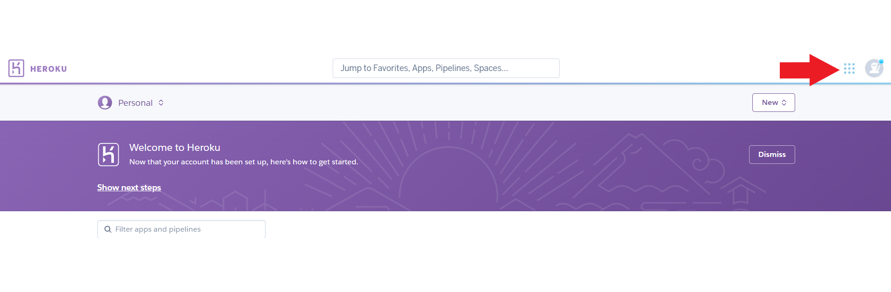

# Visualize Location on Heroku App from Android
## Introduction
Purpose of this project, displaying locations from getting database via web interface on Heroku App. The locations are saved from mobile environment which is Android Studio.
These are saved with attributes that location name, recorder, minibus name, registered date and, their geometry. Location's geometry has latitude and longitude values with respect to projection which EPSG4326 and defined on WGS84 ellipsoid.
Getting points are recorded to PostgreSQL database. To visualize points on database, the Heroku platform is used. For this aim, PostGIS is Heroku service that provides developers to build, run, and operate applications entirely in the cloud.
## Installation Requirements
###### PostgreSQL
For recording points, the PostgreSQL should be used. To download PostgreSQL, the link is given as [PostgreSQL download link](https://www.enterprisedb.com/downloads/postgres-postgresql-downloads).
To installing PostgreSQL, following link is given [Install PostgreSQL](https://www.postgresqltutorial.com/install-postgresql/)
###### Visual Studio Code
Visual Studio Code supports to use the multiple languages in one interface. The VSC is utilized for writing, running and debugging code.  To download Visual Studio Code, the link is given [Download Visual Studio Code](https://code.visualstudio.com/Download)
###### Node JS
Node.js is an open source server environment that using the JavaScript on the server. For downloading, [Download Node JS](https://nodejs.org/en/download/).
###### Git
To manage source code the Git is used that is an Open Source Distributed Version Control System. It can be downloaded from [here](https://git-scm.com/downloads/)
###### Android Studio

## Web Interface
###### Opening a Heroku Account

To create a Heroku account, the following link can be [used](https://signup.heroku.com/login?redirect-url=https%3A%2F%2Fid.heroku.com%2Foauth%2Fauthorize%3Fclient_id%3Dd2ef2b24-e72c-4adf-8506-28db2218547d%26response_type%3Dcode%26scope%3Dglobal%252Cplatform%26state%3DSFMyNTY.g3QAAAACZAAEZGF0YW0AAAAxaHR0cHM6Ly9kYXNoYm9hcmQuaGVyb2t1LmNvbS9hdXRoL2hlcm9rdS9jYWxsYmFja2QABnNpZ25lZG4GANL7onluAQ.eDiBIjGpk8wBx82K2Ej2tBwAitNPBGNQoMMDLoySy78).
The requirement informations should be entered to sign up. When the account is created, an email is sent to verify the account. After that the Heroku App must be generated with Postgres database. For this purpose, stages are given below:
1. After log in to Heroku account, press the "New" button and then click the "Create new app".
2. When creating new app, some knowledges are required.
- The unique name should be provided.
- The region option can be choosen as you want (United States or Europe).
Finally the app is created. 
3. Created Heroku App can be found from as follows :

4.
5.

